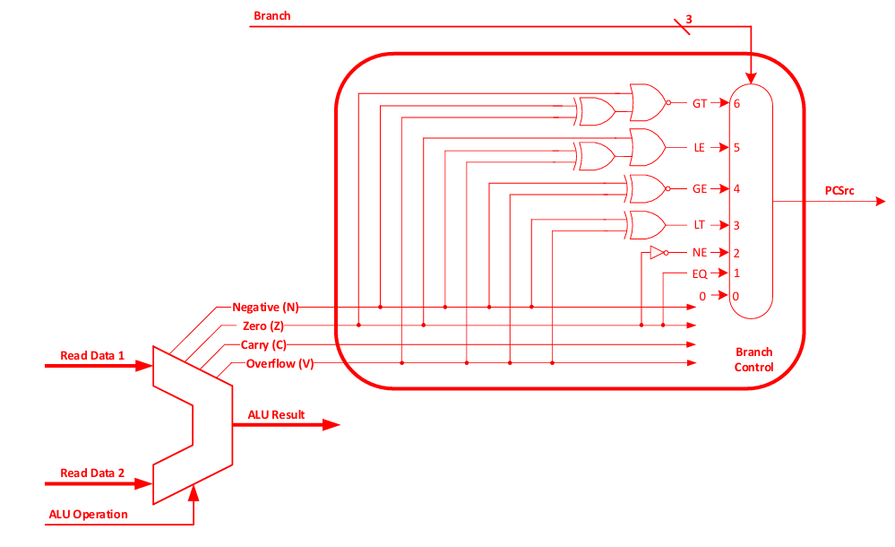

# MIPS 32‑Bit Single‑Cycle Processor

## 🧩 Project Overview

This project implements a 32‑bit single‑cycle MIPS processor in SystemVerilog. It supports the full MIPS instruction set (R, I, and J types) and is designed around modular, reusable components. The processor is validated using several benchmarks and simulations.

---

## 📚 Table of Contents

1. [Architecture](#architecture)  
2. [Modules & RTL](#modules--rtl)  
3. [Benchmarks & Testbenches](#benchmarks--testbenches)  
4. [RTL Files](#rtl-files)  
5. [Excel Tables](#excel-tables)  
6. [Simulation & Results](#simulation--results)  
7. [Usage](#usage)  
8. [Dependencies](#dependencies)  
9. [Future Work](#future-work)  
10. [License](#license)

---
## Architecture

- **Single‑Cycle Datapath**: Fetch, decode, execute, memory access, and write‑back in one cycle.
- **Harvard Architecture**: Separate instruction and data memories.
- **Control Unit**: Main, ALU decoder and Branch modules.

### 🔍 Datapath Diagram

### 🔍 Branch Diagram

---
