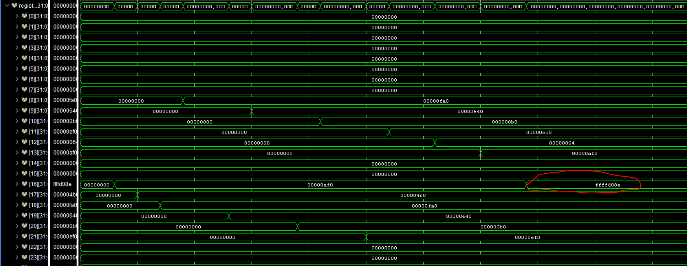
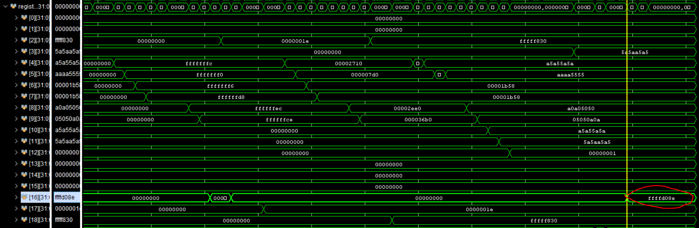
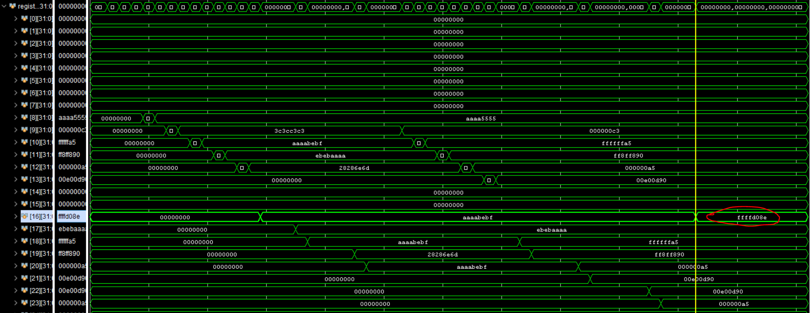

# MIPS 32‑Bit Single‑Cycle Processor

## 🧩 Project Overview

This project presents a 32-bit single-cycle MIPS processor implemented in Verilog. Designed with a modular and scalable architecture, it supports a wide range of MIPS instructions across R-type, I-type, and J-type formats. The processor executes each instruction in a single clock cycle, following the Harvard architecture model with separate instruction and data memories.

Key design components include a centralized control unit, ALU, register file, memory modules, and a structured datapath. To ensure functional accuracy, the design is rigorously verified using a suite of testbenches and real-world benchmark programs such as factorial, GCD, and others. The processor is well-suited for both educational purposes and as a foundation for more advanced pipelined or multi-cycle architectures.

## Architecture

- **Single‑Cycle Datapath**: Fetch, decode, execute, memory access, and write‑back in one cycle.
- **Harvard Architecture**: Separate instruction and data memories.
- **Control Unit**: Main, ALU decoder and Branch modules.

### 🔍 Datapath Diagram

### 🔍 Branch Control

---

## Modules & RTL

All source files are located under the `RTL/` directory.

| Module                    | Description                                                        |
| ------------------------- | ------------------------------------------------------------------ |
| `ALU_Decoder.v`           | Determines ALU control signals based on instruction function field |
| `Add_module.v`            | Performs addition logic (likely used internally in ALU or PC)      |
| `Arithmetic_Logic_Unit.v` | Main ALU: supports arithmetic and logical operations               |
| `Branch_Control.v`        | Evaluates branching conditions (e.g. BEQ, BNE)                     |
| `Main_Decoder.v`          | Decodes main instruction fields to control signals                 |
| `Control_Unit.v`          | Top-level control logic has Main Decoder, ALU Decoder and Branch   |
| `Division.v`              | Performs division operations                                       |
| `Multiplication.v`        | Performs multiplication                                            |
| `HI.v` / `LO.v`           | Special registers for storing multiplication/division results      |
| `Instruction_Decoder.v`   | Parses and decodes binary instruction format                       |
| `MIPS_32Bit_Wrapper.v`    | Top-level wrapper connecting datapath and control                  |
| `Progame_Counter.v`       | Holds and updates the current instruction address                  |
| `Register_File.v`         | Contains 32 general-purpose registers (2 read ports, 1 write)      |
| `Sign_Extension.v`        | Extends 16-bit immediate values to 32 bits                         |
| `and_2input_module.v`     | Basic 2-input AND gate                                             |
| `and_module.v`            | Generic AND logic block                                            |
| `mux_2x1.v`               | 2-to-1 multiplexer                                                 |
| `mux_4x1.v`               | 4-to-1 multiplexer                                                 |
| `mux_8x1.v`               | 8-to-1 multiplexer                                                 |
| `ram_memory.v`            | Main data memory module (read/write RAM)                           |
| `shift_left_by_2.v`       | Shifts a 32-bit value left by 2 bits (used in branch address calc) |
| `shift_left_by_16.v`      | Shifts a value left by 16 bits (possibly for `lui` instruction)    |

---
## 🎛️ Control Signals

Detailed information about the MIPS instruction formats, control signals, and ALU operation codes is provided in this Excel sheet I made :

👉 [`MIPS ISA & Control Unit.xlsx`](https://github.com/Ammar-Wahidi/MIPS-32-Bit-SingleCycle-Processor/blob/main/My%20Architecture/ISA%20and%20Control%20Unit/MIPS%20ISA%20%26%20Control%20Unit.xlsx)

This spreadsheet includes:

- **MIPS ISA reference**: Opcodes, funct fields, and instruction classifications (R, I, J types)  
- **Main Control Signals**: Signal values (RegDst, ALUSrc, MemtoReg, etc.) for each instruction  
- **ALU Control Signals**: Function-to-operation mappings  
- **Truth Tables**: Control logic for main decoder and ALU decoder  

This file was used to guide the development of key modules like `Control_Unit.v`, `Main_Decoder.v`, `ALU_Decoder.v`

---

## 📊 Benchmarks, Testbenches, Simulation & Results

in the **factorial benchmark**, the simulation concludes when the value `0xD08E` is written into register `$s0`.  
This specific moment is **highlighted with a red circle** in the waveform image.

 ### Benchmark 1

 👉 [`Test 1.asm`](https://github.com/Ammar-Wahidi/MIPS-32-Bit-SingleCycle-Processor/blob/main/Benchmarks/Test1.asm)
 

 ### Benchmark 2
 
 👉 [`Test 3.asm`](https://github.com/Ammar-Wahidi/MIPS-32-Bit-SingleCycle-Processor/blob/main/Benchmarks/Test3_v3.asm)
 

 ### Benchmark 3
 
 👉 [`Test 6 MUL / DIV.asm`](https://github.com/Ammar-Wahidi/MIPS-32-Bit-SingleCycle-Processor/blob/main/Benchmarks/Test6_mul_div_v2.asm)
 

Others tests on `Benchmarks` Folder and Screenshots on `Pictures` Folder .

 

---

